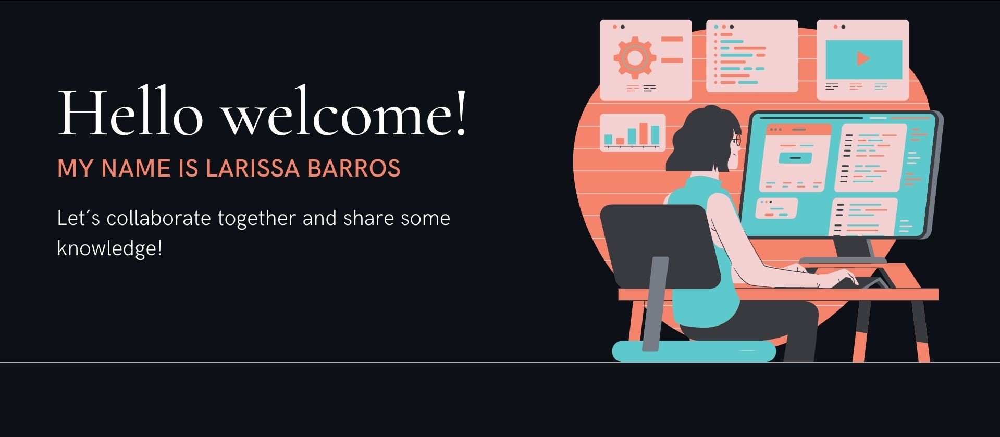

<a href="https://github.com/larissabants">

  

 

## Education: 

###### - [Instituto Federal de Educação, Ciência e Tecnologia de São Paulo](https://www.ifsp.edu.br/)
###### - [FreeCodeCamp](https://freecodecamp.org)

  
    
  
  
    
  

  

